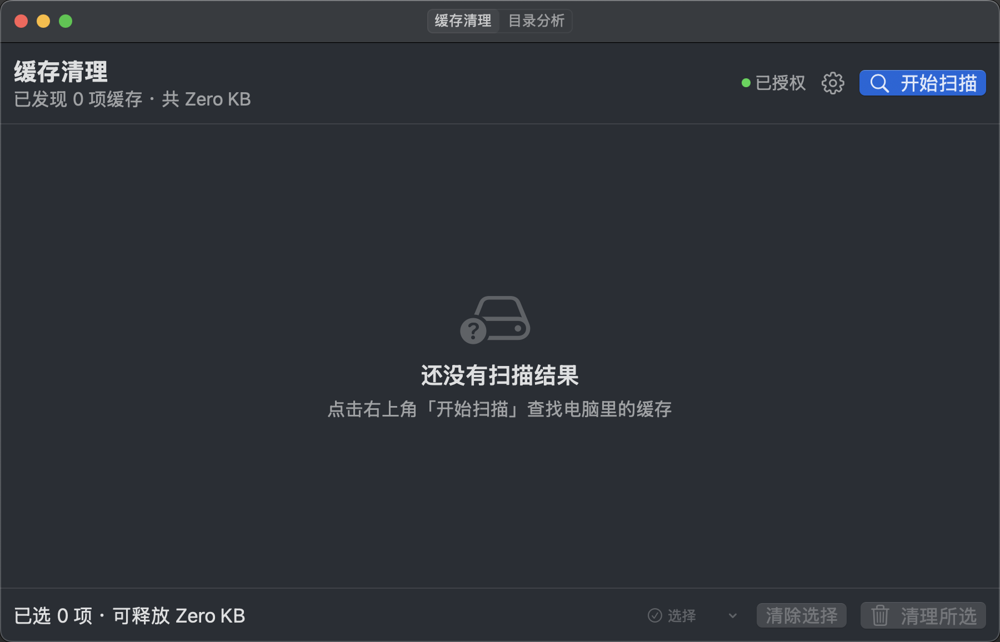
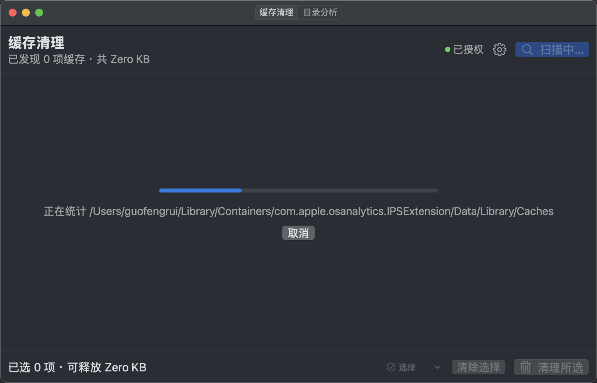
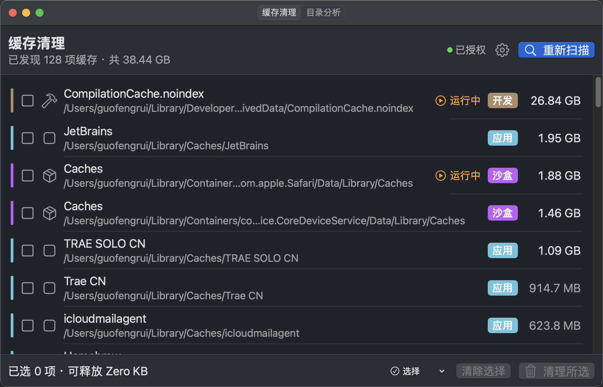
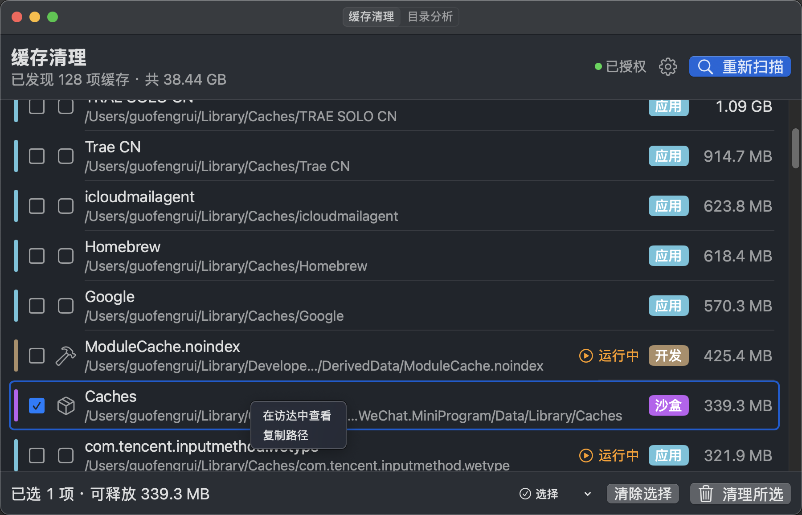
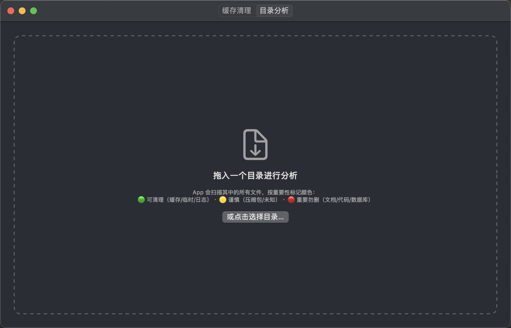
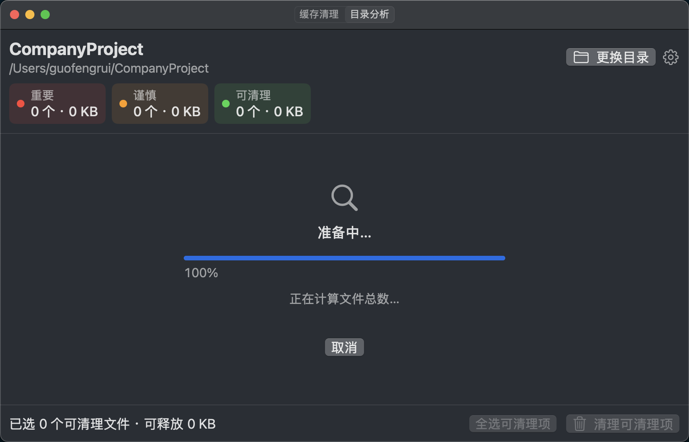
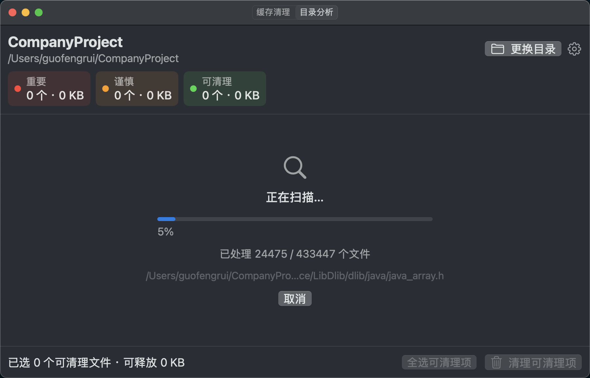
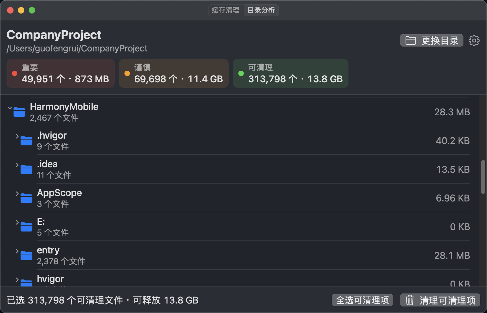
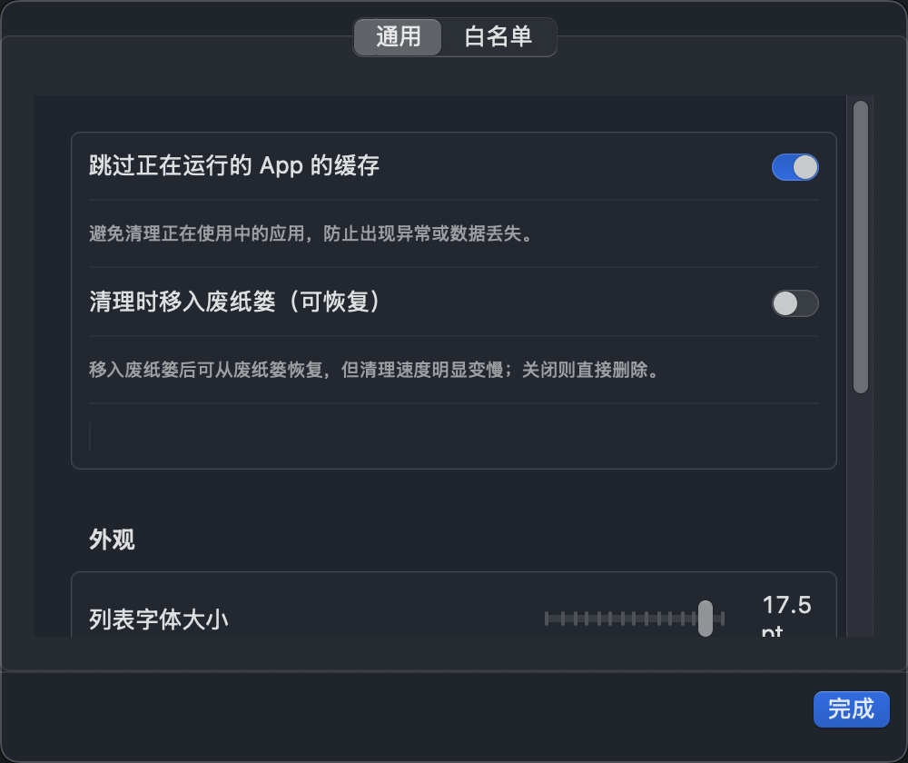
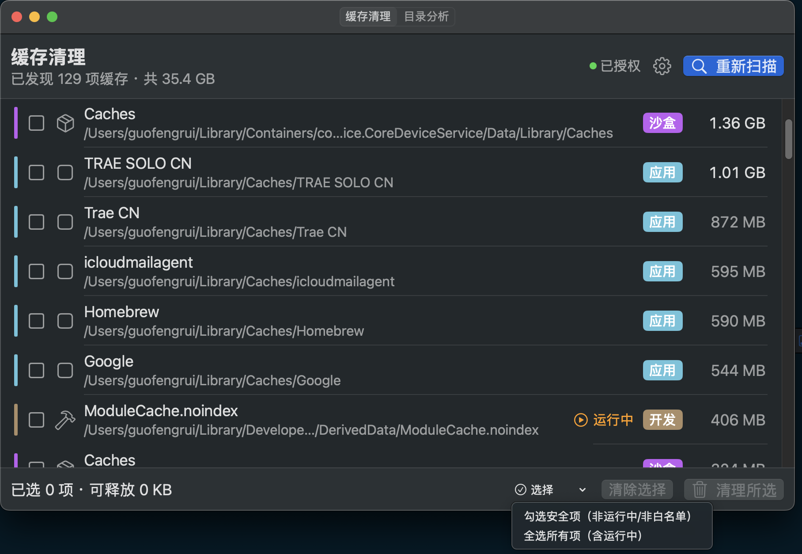

# CacheCleaner

> **macOS 磁盘缓存清理与目录分析工具** · 用 SwiftUI 写的小桌面 App

两件事做得专业：

- **缓存清理**：扫 `~/Library/Caches`、`Containers/*/Data/Library/Caches`、`Xcode DerivedData`，按大小排序、分类色条、运行中保护、白名单、废纸篓可恢复
- **目录分析**：拖入任意文件夹，递归扫描 + **红黄绿三色分级**（重要 / 谨慎 / 可清理）+ 树形展开折叠 + 真实进度条
  （默认跳过 `.app` / `.bundle` 等包内部内容，只统计包外壳）

整个项目用 SwiftUI + AppKit 写，约 3,700 行 Swift 代码，单窗口、原生界面、本地化（中文 + 英文）。

---

## 截图速览

### 🗑️ 缓存清理

| 初始空状态 | 扫描进度 | 扫描结果（128 项 / 38 GB） |
| :---: | :---: | :---: |
|  |  |  |

| 选中行 + 右键菜单 |
| :---: |
|  |

### 📂 目录分析

| 拖拽引导 | 准备中进度 | 扫描中进度 | 树形结果（13.8 GB） |
| :---: | :---: | :---: | :---: |
|  |  |  |  |

### ⚙️ 设置

| 通用设置（字体/主题/权限） |
| :---: |
|  |

### 🎨 细节：字节大小格式

| 修复前（系统 ByteCountFormatter） | 修复后（自定义 SizeFormatter） |
| :---: | :---: |
| "已发现 0 项缓存 · 共 **Zero KB**" | "已发现 0 项缓存 · 共 **0 KB**" |
|  |  |

---

## 核心特性

| 类别 | 说明 |
| --- | --- |
| 🔍 **扫描** | 后台异步、并行（8 目录/批），**不卡 UI**；扫描时实时显示当前路径与进度 |
| 🏃 **运行中保护** | 实时复核（不用扫描时快照）—— 沙盒 App（Mac App Store 装的）也能正确跳过 |
| 📋 **白名单** | NSOpenPanel 多选 + 文本输入；目录边界匹配（`WeChat` 不会误匹配 `WeChatData`） |
| 🗂️ **目录分析** | 字典分组递归 O(n·depth)，10 万文件级目录 1.5s 构建树；列表懒加载 |
| 🎨 **颜色分级** | 7 条分类规则 + 路径段优先（`Caches/` 下的 `.swift` 也算缓存） |
| 💾 **可恢复** | 一键开启"移入废纸篓"模式，删了可恢复 |
| 🛡️ **二次确认** | 清理前弹窗列出要删的项 + 预计释放 + 跳过项说明 |
| 🌍 **i18n** | 中英文双语，系统切语言自动切换（SwiftUI LocalizedStringKey 查表） |
| ♿ **无障碍** | 主要交互控件 `accessibilityLabel` 标注 |
| 🧪 **测试** | 32 个单元测试覆盖白名单边界、树构建、重要性分类、扫描一致性、i18n、UserDefaults 持久化 |

---

## 📦 安装

从 [Releases](https://github.com/GFredR/CacheCleaner/releases) 下载 `CacheCleaner-1.0.dmg`，双击打开后将 `CacheCleaner.app` 拖到右侧的「Applications」文件夹即可。

> ⚠️ 由于未做 Apple Developer 签名与公证（$99/年），首次打开请在「系统设置 → 隐私与安全性」点击「仍要打开」。

或者本地构建：

```bash
git clone https://github.com/GFredR/CacheCleaner.git
cd CacheCleaner
./build-app.sh
open CacheCleaner.app
```

需要 macOS 13+，Swift 5.9+。无第三方依赖，纯系统 API。

---

## 🚀 使用

### 缓存清理

1. 启动 App → 默认在「缓存清理」Tab
2. 点击右上角「开始扫描」（⌘R）
3. 等待几秒到几分钟（取决于缓存量）— UI 实时显示进度
4. 浏览结果（按大小倒序），勾选想清理的项
5. 默认安全操作：跳过运行中 App + 白名单
6. 「选择」菜单可一键全选安全项 / 全选所有
7. 点击「清理所选」→ 二次确认弹窗 → 执行

行右键支持「在访达中查看」「复制路径」。

### 目录分析

1. 切换到「目录分析」Tab
2. 拖入任意文件夹（或点中间「或点击选择目录…」）
3. 看到两阶段进度：
   - 阶段 1「准备中…」（统计文件总数）
   - 阶段 2「正在扫描…」（读大小 + 分类 + 真实进度）
4. 完成后顶部出现三个统计卡：🔴 重要（勿删） / 🟡 谨慎 / 🟢 可清理
5. 树形展开折叠查看结构；点击行末尾勾选绿色文件
6. 「全选可清理项」一键勾选 + 「清理可清理项」

### 设置

齿轮按钮（⌘,）打开设置：

- **通用**：跳过运行中 App、移入废纸篓、列表字体大小（11-18 pt）、主题（浅色/深色/跟随）
- **白名单**：点「浏览…」选目录（支持多选 + 自动添加），或输入路径按 Enter

---

## 🛡️ 安全声明

> **⚠️ 本工具会删除文件，使用前请仔细阅读**

本工具会**删除文件**，请先了解它的行为边界：

- **清理范围**：只删除缓存目录的**内容**（保留目录本身），App 运行时可正常重建
- **运行保护**：默认跳过正在运行的 App 的缓存（Xcode 开着时其 DerivedData 也会标记）
- **双重确认**：清理前弹窗列出将要删除的项目，需手动确认
- **可恢复**：设置里可开启「移入废纸篓」，删除后可恢复
- **可审计**：整个项目开源，删除逻辑在 `CacheCleanerService.swift` / `DirectoryAnalysisModel.swift`，可自行核对；目录分析的绿色标记只是**建议**，勾选后仍会弹窗二次确认
- **免责**：虽经多种保护，仍建议对重要数据保持备份习惯

**使用本工具造成的数据丢失，作者不承担任何责任**（详见 [LICENSE](LICENSE) 中的 AS IS 免责声明）。

---

## 🛠️ 开发

```bash
# 编译
swift build

# 跑测试（32 个用例）
swift test

# 打 .app
./build-app.sh

# 打 .dmg（带背景图 + Finder 布局）
./make-dmg.sh
```

**项目结构**：

```
CacheCleaner/
├── Sources/CacheCleaner/
│   ├── CacheCleanerApp.swift              # App 入口 + 主题
│   ├── Models/                            # CacheItem / ImportanceLevel / DirectoryNode
│   ├── Services/                          # Scanner / Cleaner / DirectoryAnalyzer / SizeFormatter / AppNameMapper / Permission
│   ├── ViewModel/                         # 两个 @MainActor 视图模型
│   └── Views/                             # SwiftUI 视图
├── Resources/
│   ├── AppIcon.png                        # 圆角矩形垃圾桶图标
│   ├── donate-wechat.png                  # 收款码（带全图斜纹水印）
│   ├── dmg-background.png                 # DMG 安装包背景
│   ├── zh-Hans.lproj/                     # 中文翻译
│   └── en.lproj/                          # 英文翻译
├── Tests/CacheCleanerTests/               # 32 个单元测试
├── screenshots/                            # README 配图
├── docs/CODE_REVIEW.md                    # 全项目代码审查报告
├── build-app.sh / make-dmg.sh             # 打包脚本
├── Package.swift                          # SPM 描述
└── .github/workflows/                     # CI：build + test
```

代码风格遵循 [iOS 完整项目开发全局规范](https://github.com/GFredR/workspace)（如不可访问可参考本地 `AGENTS.md`）。

更多审查细节：见 [`docs/CODE_REVIEW.md`](docs/CODE_REVIEW.md)（4 轮审查 + 已修复问题清单 + 实测验证记录 + 设计决策）。

---

## ☕ 支持作者

如果 CacheCleaner 帮你腾出了空间，欢迎打赏（一杯咖啡即可）：

<div align="center">

</div>

> 收款码仅用于本项目的自愿打赏，请勿他用。

---

## 📄 License

本项目采用 [MIT](LICENSE) 协议。

<details>
<summary><strong>📝 MIT 协议中文摘要（辅助说明，非法律文本）</strong></summary>

> ⚠️ 以下为中文解读，**不具有法律效力**，法律文本以英文 LICENSE 为准。

| 你可以… | 你必须… | 你不能… |
| --- | --- | --- |
| ✅ 自由使用、复制、修改本项目 | 📋 在所有副本中保留版权声明 | ❌ 让作者为使用本项目产生的任何损失负责 |
| ✅ 用于商业目的（包括打包出售） | 📋 保留 MIT 协议原文 | ❌ 用作者名义为衍生作品背书 |
| ✅ 修改后再分发（保留版权声明即可） | | ❌ 移除或修改原作者的版权信息 |
| ✅ 申请专利使用（作者明确授予） | | |

**简单说**：随便用、随便改、随便卖，只要保留原作者署名 + 协议原文，作者不背锅。国际上没有"中文版 LICENSE"，法律文本以英文 LICENSE 为准。

</details>

[MIT](LICENSE) © 2026 GFredR

---

## ❓ FAQ

**为什么扫描结果比 CleanMyMac 少？**
未授权「完全磁盘访问权限」时，受 TCC 保护的目录不可见（设置里点"重新检测"→ 跳到系统设置授予权限）；另外本工具暂不处理系统级缓存 `/Library/Caches`（需 root）。授权 + 重新扫描后结果会比较完整。

**目录分析里 .app 包为什么不算大小？**
为性能与安全，目录分析默认跳过 `.app` / `.bundle` 等包内部（`skipsPackageDescendants`），拖入 `/Applications` 时每个 App 只统计外壳文件。想统计包内可改 `DirectoryAnalyzer.swift` 的 `options`。

**清理能撤销吗？**
设置 → 勾选「清理时移入废纸篓（可恢复）」即可。默认关闭，关闭时直接删除不可恢复。

**能清理 Windows / Linux 路径吗？**
当前仅 macOS 平台，所有清理逻辑都用系统 API 实现（`FileManager` / `NSWorkspace`）。

**SwiftUI 国际化是怎么做的？**
用 `Localizable.strings`（中英文双语）+ Package.swift `defaultLocalization`。所有 UI 字面量都是 `Text("中文")` 形式，SwiftUI 在 macOS 13+ / Swift 5.9 自动推断为 `LocalizedStringKey` 查表，系统切首选语言即时切换，无需改任何代码。

---

## 🙏 致谢

- 苹果 SF Symbols 提供的免费图标（垃圾桶/盾牌/扫描/星星等）

- 苹果 SF Symbols 提供的免费图标（垃圾桶/盾牌/扫描/星星等）
- 项目启动时参考了 [CleanMyMac](https://macpaw.com/cleanmymac) 的 UX 思路
- AI 协作：开发过程大量由 AI 辅助（架构设计、代码生成、bug 排查、安全审查）
- 4 轮代码审查（commit 链 `1c9a1d6` → `1e13d20` → `8ac7905` → `8fe7e0e` → `6b39274` → `8c46dc9` → `a2afe50` → `b085e46`）捕到 19+ 处真实 bug
